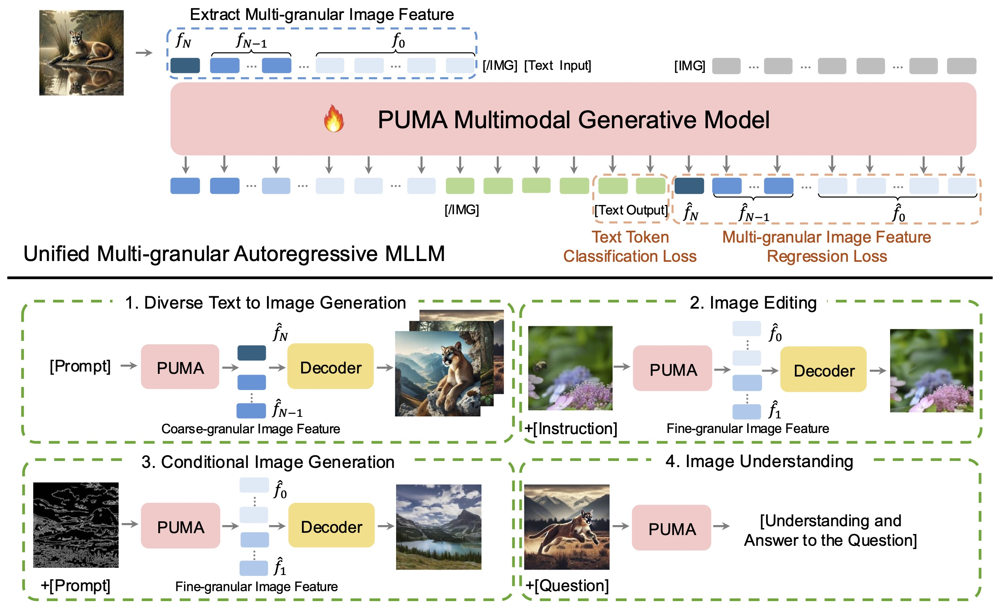
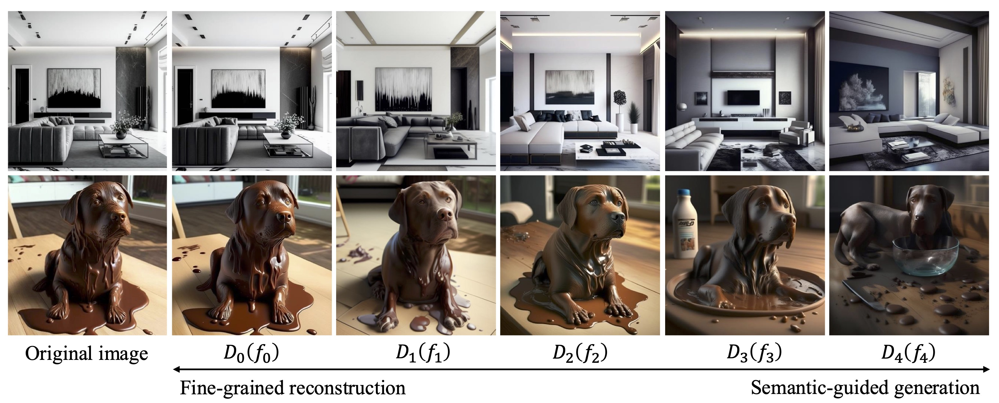
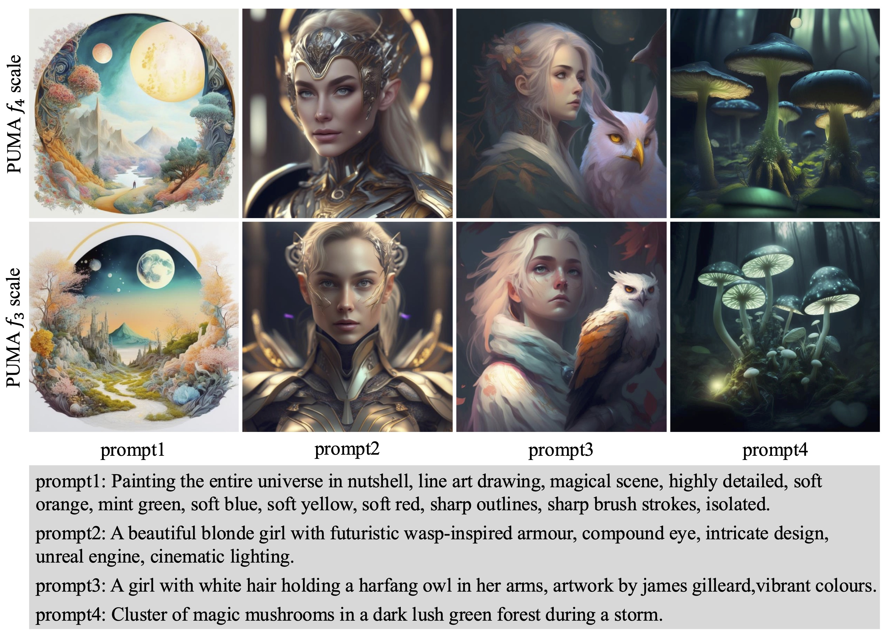
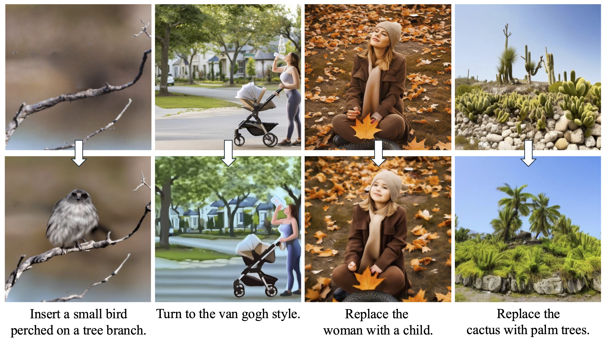
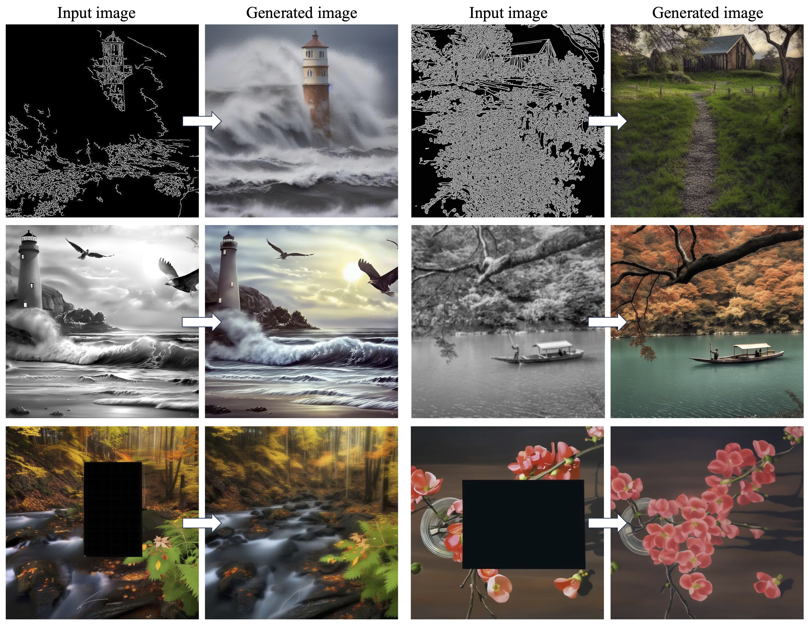

<p align="center">
    
</p>

## PUMA: Empowering Unified MLLM with Multi-Granular Visual Generation

<p align="center">

</p>

[Rongyao Fang](https://scholar.google.com/citations?user=FtH3CW4AAAAJ&hl=en)<sup>1\*</sup>, [Chengqi Duan](https://scholar.google.com/citations?user=r9qb4ZwAAAAJ&hl=zh-CN)<sup>2\*</sup>, [Kun Wang]()<sup>3</sup>, [Hao Li](https://scholar.google.com/citations?user=qHqQsY4AAAAJ&hl=zh-CN)<sup>1,4</sup>, [Hao Tian]()<sup>3</sup>, [Xingyu Zeng]()<sup>3</sup>, [Rui Zhao]()<sup>3</sup>, [Jifeng Dai](https://jifengdai.org/)<sup>4,5</sup>, [Hongsheng Li](https://www.ee.cuhk.edu.hk/~hsli/)<sup>1 :envelope:</sup>, [Xihui Liu](https://xh-liu.github.io/)<sup>2 :envelope:</sup>

<sup>1</sup>CUHK MMLab, <sup>2</sup>HKU MMLab, <sup>3</sup>SenseTime, <sup>4</sup>Shanghai AI Laboratory, <sup>5</sup>Tsinghua University

*Equal contribution, :envelope:Corresponding authors

:fire: **We will release the code and models soon!**

## :book: Table of Contents
- [Update](#update) 
- [TODO](#todo)
- [Abstract](#abstract)
- [Framework](#framework)
- [Multi-granular Semantic Visual Decoding](#decoding)
- [Diverse Text-to-image Generation](#t2i)
- [Image Editing](#image-editing)
- [Image Conditional Generation](#cond_gen)

## <a name="update"></a>:new:Update
- **2024.10.18**: PUMA preprint is released on ArXiv 🎉.

## <a name="todo"></a>:hourglass: TODO

- [ ] Update links to project page :link:
- [ ] Release visual encoder and decoders checkpoints :computer:
- [ ] Release MLLM backbone checkpoint :floppy_disk:

## <a name="abstract"></a>Abstract

> **PUMA** introduces a unified multimodal large language model framework designed to integrate multi-granular visual generation and understanding. Our model excels in a variety of visual tasks, including diverse text-to-image generation, precise image editing, conditional image generation, and visual understanding. It strikes a balance between generation diversity and controllability, making it a versatile tool for visual tasks.

Read the full paper [here](https://arxiv.org/abs/your_paper_id).

## <a name="framework"></a>Framework

<p align="center">
    
</p>
- PUMA leverages multi-granular visual representations as unified inputs and outputs for MLLM, allowing it to handle a variety of visual tasks, including text-to-image generation, image editing, inpainting, colorization, conditional generation, and image understanding.

## <a name="decoding"></a>Multi-granular Semantic Visual Decoding

<p align="center">
    
</p>

- PUMA's visual decoding process spans five granular image representations (f<sub>0</sub> to f<sub>4</sub>) and corresponding decoders (D<sub>0</sub> to D<sub>4</sub>), which are trained using SDXL. This allows PUMA to achieve precise image reconstruction and semantic-guided generation, supporting both control and diversity in image generation tasks.

## <a name="t2i"></a>Diverse Text-to-image Generation

<p align="center">
    
</p>

## <a name="image_editing"></a>Image Editing

<p align="center">
    
</p>

## <a name="cond_gen"></a>Image Conditional Generation

<p align="center">
    
</p>

## <a name="citation"></a>Citation

If you find PUMA useful in your research, please consider citing us:

```
@article{fang2024puma,
  title     ={PUMA: Empowering Unified MLLM with Multi-Granular Visual Generation},
  author    ={Rongyao Fang, Chengqi Duan, Kun Wang, Hao Li, Hao Tian, Xingyu Zeng, Rui Zhao, Jifeng Dai, Hongsheng Li, Xihui Liu},
  journal   = {arxiv},
  year      ={2024}
}
```

## <a name="license"></a>License

This project is released under the [Apache 2.0 license](LICENSE).

## <a name="contact"></a>Contact

If you have any questions, please feel free to contact rongyaofang@gmail.com.